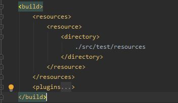
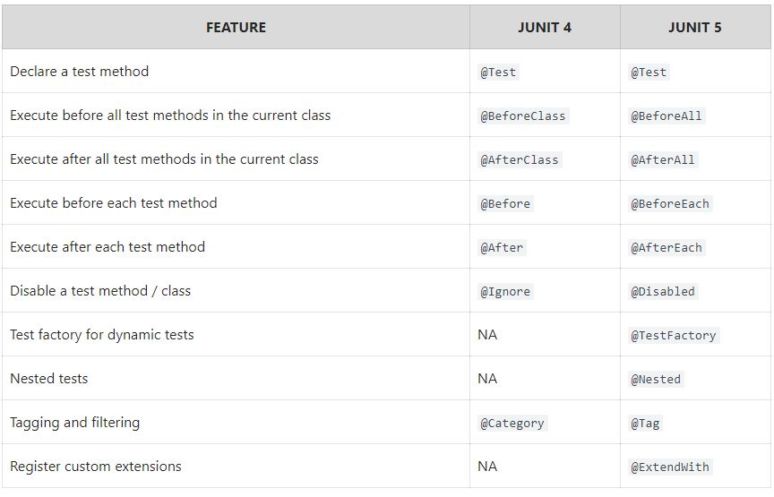

# Allure 2 with Junit 5 examples
- I have added TODOs with blank class covering al most all important topic of junit5

# Maven Run commands 
- To test 
        
      ./mvnw clean varify

- To build & see report 

      ./mvnw allure:report      
      ./mvnw allure:serve

# Test Project  
- Calculator class to test 

# Allure : POM integration
- Add allure & aspectJ version property (optional, but i follow as best practices)

         <allure.version>2.13.2</allure.version>
         <aspectj.version>1.9.5</aspectj.version>
- Add allure as dependency under dependencies 
        
         <dependency>
              <groupId>io.qameta.allure</groupId>
              <artifactId>allure-junit5</artifactId>
              <version>${allure.version}</version>
          </dependency>
          
- Add allure plugins

          <plugin>
                <groupId>io.qameta.allure</groupId>
                <artifactId>allure-maven</artifactId>
                <version>2.10.0</version>
                    <configuration>
                         <reportVersion>${allure.version}</reportVersion>
                         <allureDownloadUrl>https://repo.maven.apache.org/maven2/io/qameta/allure/allure-commandline/${allure.version}/allure-commandline-${allure.version}.zip</allureDownloadUrl>
                    </configuration>
           </plugin>

# Allure Properties
- create an allure.properties file and keep in class path (src/test/resources/)
- Add at least report folder property 

        allure.results.directory=target/allure-results
- To include this in class path, you may use this maven build configuration. 

# Allure : Annotation (explain  => todo)
- @Step : Each step method to perform a test
- @AllureId :
- @Attachment :
- @Description :
- @Epic :
- @Epics :
- @Feature :
- @Features :
- @Flaky :
- @Issue :
- @Issues :
- @Lead :
- @Link :
- @Links :
- @Muted :
- @Owner :
- @Severity :
- @Stories :
- @Story :
- @TmsLink :
- @TmsLinks :

# Junit 5 Basics
- There are three projects groups in Junit 5
- JUnit Platform :(Making framework/Runners) It defines the TestEngine API for developing new testing frameworks that runs on the platform.
- JUnit Jupiter : (most of people needs) It has all new junit annotations and TestEngine implementation to run tests written with these annotations.
- JUnit Vintage:(back compatibility) To support running JUnit 3 and JUnit 4 written tests on the JUnit 5 platform.
- Annotation comparison with Junit 4 

# Junit 5 : Annotations(explain -> todo)
- @AfterAll
- @AfterEach : 
- @BeforeAll :
- @BeforeEach :
- @Disabled :
- @DisplayName :
- @DisplayNameGeneration :
- @Nested :
- @Order :
- @RepeatedTest :
- @Tag :
- @Tags :
- @Test :
- @TestFactory :
- @TestInstance :
- @TestMethodOrder :
- @TestTemplate :
- @Timeout :

# Allure : Installations  (optional:if you want to use allure in CLI)
 1. Download latest allure ZIP file from [here](https://repo.maven.apache.org/maven2/io/qameta/allure/allure-commandline/) . I used 2.13.2.
 2. Extract & goto bin directory, you can see allure.bat/allure. Put this directory path as system path. In my case, i have added in win 10 path variable this path "C:\Users\Shantonu\apps\allure-2.13.2\bin"   
