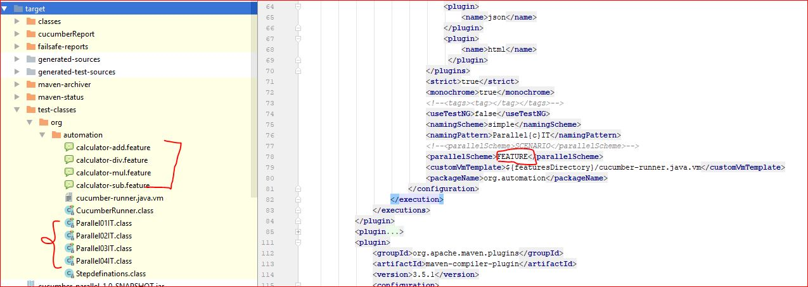

# Parallel Cucumber Example : TODO => need to update 
Parallel run cucumber JVM

# Target 
- Cucumber Runner 
- Running Scenarios in parallel 
- Running Features in parallel

# Key Config 
Find out "parallelScheme" and make it 
- FEATURE to run fetures parallel (i prefer)
- SCENARIO to run scenarios parallel

# Project
A simple calculator for testing cucumber features/scenarios in parallel

# Testing command (use maven 3.3.9)
mvn clean verify 

# How it works
 1. First it reads the pom configuration 
 2. Reads the Runner Template java class
 3. Generates test classes under generated test resources 
 4. Put those test classes under test-classes 
 5. Finally run those generated runner classes. 
 
 Here is a image of target folder
 
 
 

