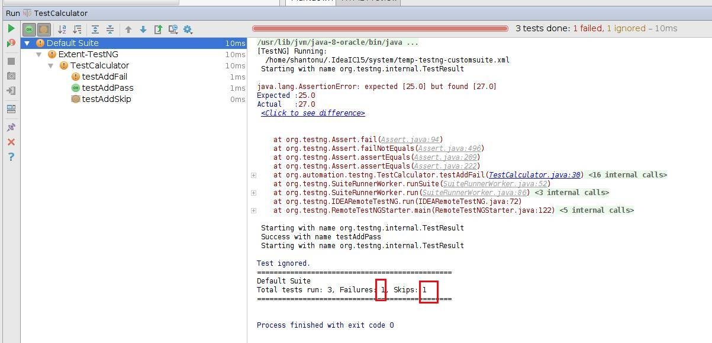
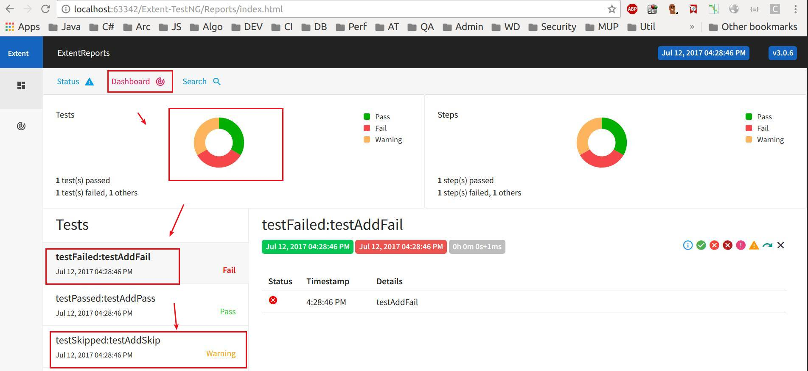
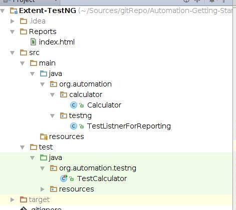

# extent report example with TestNG
Making report with extent

# main project link 
http://extentreports.com/community/ 

# Run 
1. You can run with you IDE runner (eclipse/intelliJ)
2. With maven : mvn clean test

# Running in IDE 

# Generated Report 

# Project Structure
