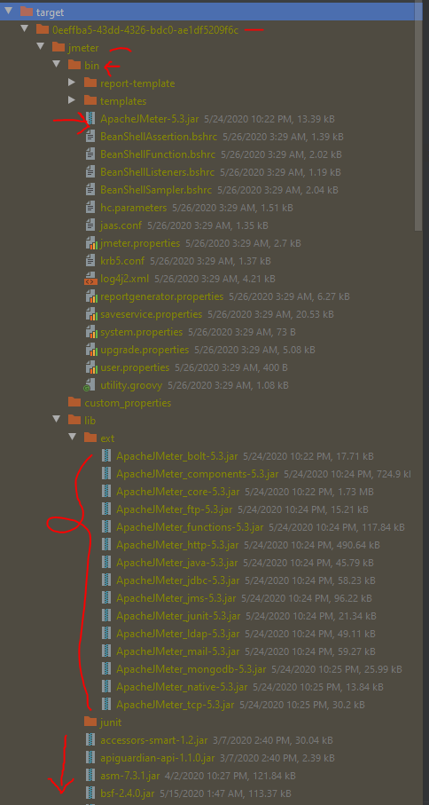
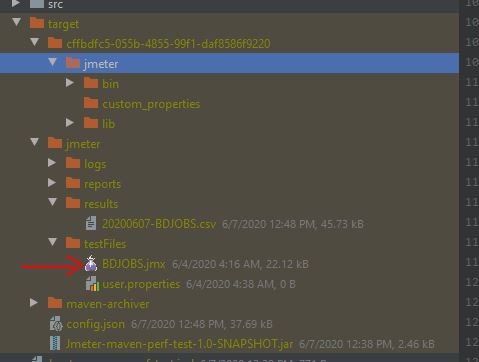
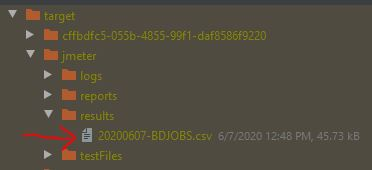

# Jmeter tests with maven plugins
- We will run test 
- we will analyze results
# Run test 

        mvn clean verify 

# What happens during test 
- mvn clean => clean target folder (if it has old results)
- mcn verify, it actually tests. In test plugins we have 3 execution goals. 
1. configure : it downloads and premiere Jmeter as confirmed by plugin. you will seen inside target folder this 
 

2. jmeter : it runs original test following properties. A test file invoked from /src/test/jmeter to target/testFiles. you will see this 

3. results: it analyze the results and save as CSV (default) in results 

# Maven Plugins executions
- Upto now,from [source code](https://github.com/jmeter-maven-plugin/jmeter-maven-plugin/tree/master/src/main/java/com/lazerycode/jmeter/mojo), i see there are 5 executions
configure,gui,jmeter,results, remote-server. All will work under integration (verify) lifecycle of maven. 
- In the test we have use configure , test & results. 
- "remote-server" is used only when we are making slave-master configuration for distributed jmeter tests. 

# Java Properties
# User Properties
# How to Script in Jmeter to run using this plugins
# JVM Arguments

# Notes
- plugins 3.1.0 use jmeter 5.3
- This does not need analysis plugins, just need and extra execution step