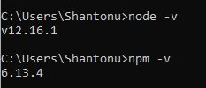

# Cross Browser testing playwright (todo)

# project ![Link] (https://playwright.dev/)

# Installatiion 
- install node js from 
- make sure your NPM installed when you install nodejs. to do that , check versions

		node -v 
		npm -v 
		
you should be able to see version info. 
This is from my PC installed   
		
- install playwright 

		npm i playwright