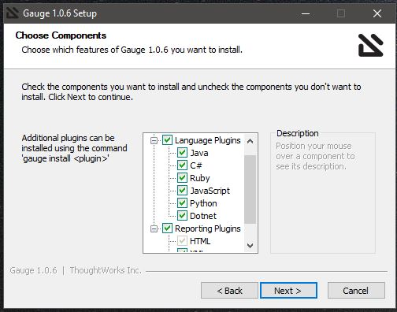

# Gauge Java (todo)
A small business case testing framework 

# Installation 
- Download this in your PC or server where test will run

For my case, I am using windows 10 installation. 
- https://github.com/getgauge/gauge/releases/download/v1.0.6/gauge-1.0.6-windows.x86_64.exe
- Options : I have chosen all language & reporting plugins (everything)

# Prepare your IDE
- install VsCode 
- install Gauge [Extension](https://marketplace.visualstudio.com/items?itemName=getgauge.gauge)

# Use Maven Arc type
-gauge-archetype-java

# How to use the example

# Documentation Home 
- https://docs.gauge.org/index.html
# IntelliJ Plugins
- https://plugins.jetbrains.com/plugin/7535-gauge