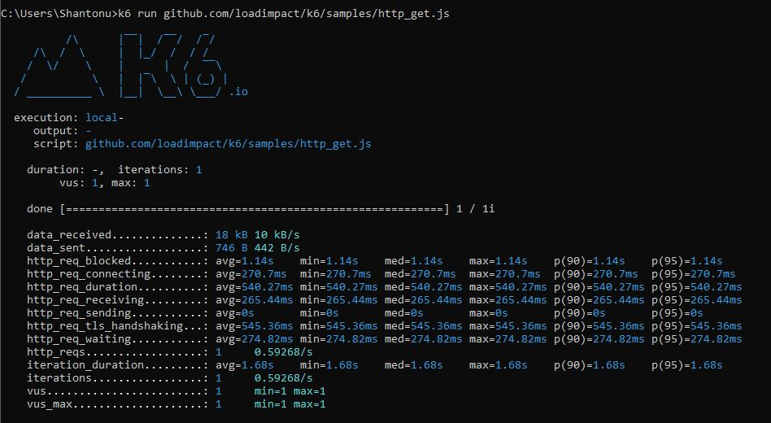

# k6 perf testing(todo)

# Basic Info 
- Its JavaScript based performace testing 
- its not nodeJS or can run browser. 
- we can have request specific passing criteria 
- it has tools to convert Jmeter/HAR/Postman to k6 converter
- It has openAPI generator (automatically convert api to performace scripts)

# Installation 
- [Windows](https://dl.bintray.com/loadimpact/windows/k6-latest-amd64.msi)
- Ubuntu 

		sudo apt-key adv --keyserver hkp://keyserver.ubuntu.com:80 --recv-keys 379CE192D401AB61
		echo "deb https://dl.bintray.com/loadimpact/deb stable main" | sudo tee -a /etc/apt/sources.list
		sudo apt-get update && sudo apt-get install k6

# Run your test 

		k6 run script.js

# Running first sample test 

		$ k6 run github.com/loadimpact/k6/samples/http_get.js
		

# Main Project [Link] (https://k6.io/open-source)

# CLI Options 

		Usage:
	  k6 [command]

	Available Commands:
	  archive     Create an archive
	  cloud       Run a test on the cloud
	  convert     Convert a HAR file to a k6 script
	  help        Help about any command
	  inspect     Inspect a script or archive
	  login       Authenticate with a service
	  pause       Pause a running test
	  resume      Resume a paused test
	  run         Start a load test
	  scale       Scale a running test
	  stats       Show test metrics
	  status      Show test status
	  version     Show application version

	Flags:
	  -a, --address string     address for the api server (default "localhost:6565")
	  -c, --config string      JSON config file (default "C:\\Users\\Shantonu\\AppData\\Roaming\\loadimpact\\k6\\config.json")
	  -h, --help               help for k6
		  --logformat string   log output format
		  --no-color           disable colored output
	  -q, --quiet              disable progress updates
	  -v, --verbose            enable debug logging

	Use "k6 [command] --help" for more information about a command.