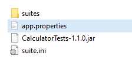
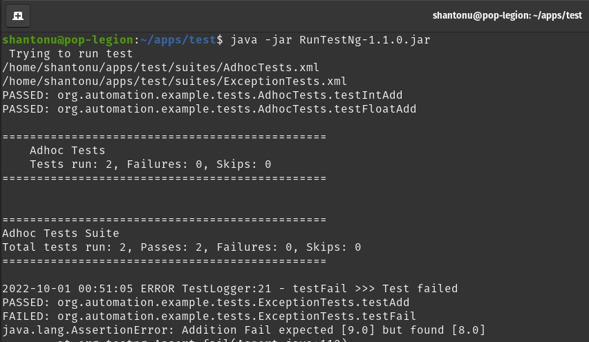
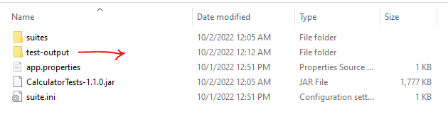
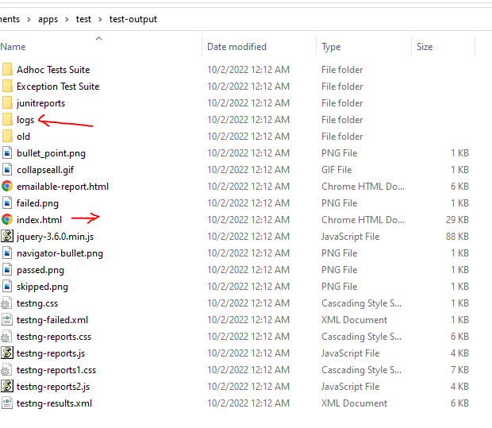

# Main Goal
Making executable JAR file to run tests

# Side Goals 
- Include all dependencies 
- Only having JRE should run the App
- Separate folder for suiteXML
- A ini file to maintain Listeners 


# Requirements For compiling project
- Open Jdk 11 

# Maven Commands 
- To make executable JAR ```mvn -DskipTests=true package```

# Running 
- A folder containing this 



type cmd ```java -jar CalculatorTests-1.1.0.jar``` 

and you should see results like this 



Expected output : 
1. CMD output of log
2. Test Results in HTML
3. Log output 

The output folder 



inside the folder 

